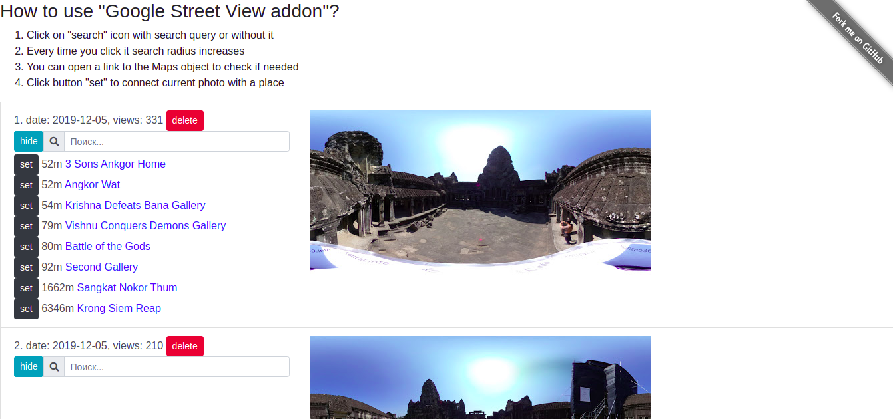

# Google Street View Addon
At some moment Google Street View application for Android  stopped showing places around uploaded panoramic photos.
Feature "Add a Maps listings" still does not show options at all.

That's why this tiny single-page application was created, to allow you to connect your uploaded panoramic photos with places around.

## Features
* it shows list of your photos in Google Street View, where you can see
    * date
    * views
    * link to Google Maps
* allows to connect panoramic photo with a place on Google Maps by searching it
* ability to delete photo permanently from Google Maps (it's especially useful if some photos were uploaded twice by accident)

## How to set it up?
1. Create credentials in Google APIs of "OAuth client ID" kind here: https://console.developers.google.com/apis/credentials
    * Type: Web application
    * Set up your domain.
    * In more details: https://developers.google.com/maps/gmp-get-started

2. Save Client ID as `clientId` variable in `credentials.js` in the same folder with this file.

3. Generate API Key and save it as `apiKey` variable in `credentials.js`.

4. Activate APIs:
    * https://console.developers.google.com/apis/api/streetviewpublish.googleapis.com/overview
    * https://console.developers.google.com/google/maps-apis/apis/places-backend.googleapis.com/metrics

5. Open this file in browser:
    * there will be a modal window opened with a request to choose and Google account to authorize application.
    * it will list data that application will get access to

## Screenshots

Example how it works:
https://iho.su/streetview/
